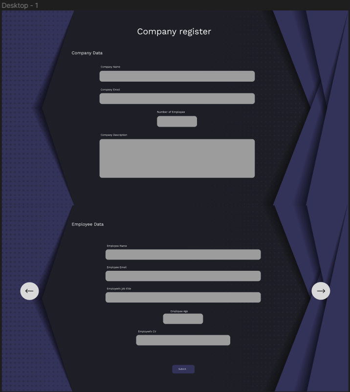
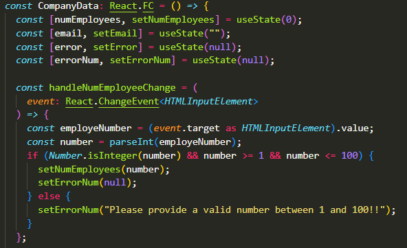
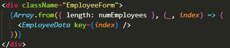
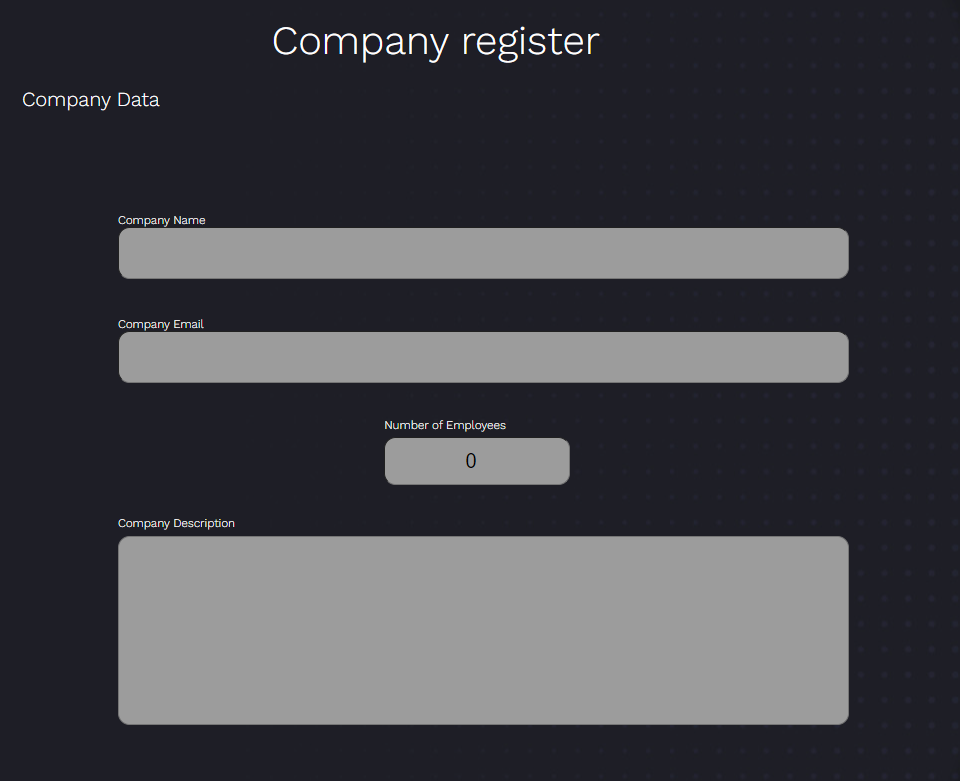
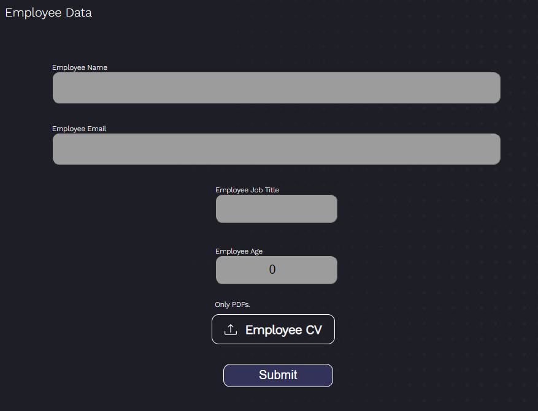

# Company Registry application made by React Typescript

This application help a company store there basic company information and store there workers information in a single file which can be handled in many ways.

# How it's looking

The first step is fill some company information (Name, Main e-mail address, Number of employees and in case a Description). When the somebody enter the number of employees than the application will generate that many Employee Form. On the employee form need to fill the employee's name, e-mail address, age and job title. The job title can contain 4 option to choose from.

# Made with

The application made with mainly React Typescript. For styling just basic CSS.
I gathered resource for the work from
Youtube but the most of from:
https://youtube.com/@javascriptmastery
About basic questions, how should i do this/that, etc.
https://stackoverflow.com/
https://www.w3schools.com/
The email validation is came from here
https://bobbyhadz.com/blog/react-check-if-email-is-valid
I found the background picture here
https://www.vecteezy.com/vector-art/5909540-hexagon-abstract-modern-background-with-overlapping-triangle-decoration-small-dots-background-texture-decoration-suitable-for-backdrops-wallpapers-banners-websites-eps-10

# The hardest part of the project

Tried to implement that, when the user press on the submit button the application will wrap the data from the forms and send it. I look after it but it is so out my current knowledge than i decided to leave it out. If i could start over again than i know now how i need to build and structurise this project.

# How should it look like

# Proudest part

I'm the most proud to the rendering part where the app render x number of Employee Form when the user fill the Number of Employees field.

# How it's working

1. We need to fill out the company data section (Company Name, Email, Description, Number of Employees)

2. When the Number of Employee filled out than the rest of the page will be generated. We need to write there those peoples data also.

When every employees data ready, just press the Submit button and the database will be updated.

Thank you for look after my project. If you have any question or want to reach out for me, my contact is the following
E-mail: szpeter.yt@gmail.com
